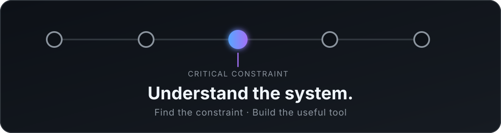

  

# Hi, I'm Dam

I build tools, systems, and games around problems I want to understand or solve.

Most of my projects begin with a limitation I encounter directly: too much information to process, software that is difficult to understand, unreliable infrastructure, or a game that does not exist yet.

I usually start by researching the problem, testing different approaches, and building a focused prototype that answers one concrete question. From there, I keep what proves useful, remove what does not, and refine the project through real use.

---

## What I'm working on

### 🎮 Blorb Mayhem

A 2D turn-based artillery game built with Godot.

It combines destructible terrain, projectile systems, dynamic camera behavior, multiplayer networking, dedicated server infrastructure, character customization, and a growing collection of weapons and abilities.

The project is currently in active development and has already been tested through remote multiplayer sessions.

### ◈ NexoPrime

A market-monitoring tool for microcaps on Base.

It began with a problem I repeatedly encountered while trading: the difficulty was not understanding one chart, but deciding which of many charts deserved attention at a particular moment.

Instead of displaying more data, NexoPrime summarizes multiple assets into a visual priority system designed to answer:

> Where should I look right now?

It became part of my regular workflow and evolved through repeated testing, removal of unnecessary information, and integration of multiple data sources.

### ◇ Tachyon

An experimental visual runtime explorer for Python.

Tachyon started from a simple problem: software could be generated faster than I could fully understand its execution.

Its goal is to represent a running program as a visual flow, making relationships between functions, data, and execution easier to follow.

<strong>Other projects</strong>

 

- Buffito — on-chain analysis and contract inspection experiments.
- FlashBlade — security-focused swap execution tooling.
- FlashBlocks — infrastructure built to reduce dependency on rate-limited public APIs.

---

## How I approach projects

Understand → Research → Diagnose → Prototype → Validate → Refine

A few principles appear consistently across my work:

- Understand the context before choosing technology.
- Treat early conclusions as hypotheses.
- Build the smallest prototype capable of answering a useful question.
- Test ideas through real use rather than assumptions.
- Keep what improves the result.
- Remove complexity that cannot justify itself.
- Design with failures and changing dependencies in mind.

I use AI extensively during research and implementation, while remaining responsible for the decisions, testing, and final behavior of the systems I build.

---

## What I care about

I am less interested in building software for its own sake than in understanding the limitation behind it.

Sometimes the right solution is an application. Sometimes it is a smaller tool, a change in process, or a simpler way of presenting information.

The technology can change from one project to another. The part I try to keep consistent is the way I investigate, decide, test, and refine.

> The goal is not to write more software. It is to solve the right problem.

---

## Current focus

Most of my time is currently going into Blorb Mayhem, while I organize the documentation and public history of my other projects.

This profile is a work in progress. Repositories, technical notes, and case studies will be added as they are prepared for public release.

---

## Contact

Portfolio: coming soon  
